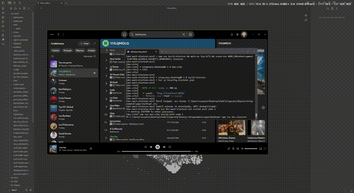

# Singevery

> Teleprompter transparente para cantar: reconoce la canción que suena y muestra la letra sincronizada con karaoke en tiempo real.

**Repositorio:** https://github.com/Grizaceo/Singevery

Widget de escritorio transparente para **cantar con la letra sincronizada**: reconoce la canción que suena, muestra la letra con karaoke (palabra a palabra) y ofrece **ayudas de lectura por idioma** (furigana, romaji, ruby, romanización) más **traducción línea a línea** opcional.

App activa: **[`apps/desktop`](apps/desktop)** — Electron + React 19 + TypeScript.

## Descargas

[](https://github.com/Grizaceo/Singevery/releases/latest)

Descarga el instalador de Windows desde **[GitHub Releases](https://github.com/Grizaceo/Singevery/releases/latest)** (`Singevery-Setup-x.y.z.exe`).

> **SmartScreen:** el instalador no está firmado con certificado de código. Windows puede mostrar *"Windows protegió tu PC"*. Pulsa **Más información → Ejecutar de todos modos** para continuar.

## Demo



[▶ Ver video completo (HD)](https://github.com/Grizaceo/Singevery/blob/main/docs/demo.mp4)

> **¿Quieres reproductor MP4 inline en el README?** GitHub no lo permite con archivos del repo (`raw/main/...` sale como enlace). Edita el README en github.com, arrastra [`docs/demo-readme.mp4`](docs/demo-readme.mp4) (~1 MB) al editor y GitHub insertará una URL `user-attachments` que sí se reproduce embebida. Sustituye el GIF por esa URL.

En la grabación:

1. Pill **SING** o atajo **Ctrl+Alt+S** con música sonando (Spotify / navegador).
2. Letra sincronizada sobre el escritorio (overlay transparente + click-through).
3. Modos de lectura (原 / ふ / か / A / T) y ajustes (⚙).

## Qué hace

- **Reconoce música** desde el audio del sistema o el micrófono (Shazam gratuito en modo auto, con fallback a AudD).
- **Sincroniza la letra** en tiempo real con resaltado karaoke y corrección de deriva.
- **Overlay transparente** sobre el escritorio: modo pill (SING), click-through mientras cantas, arrastrable.
- **Windows:** integración con el reproductor del SO vía SMTC (Spotify, navegador, etc.) como reloj maestro cuando está disponible.

## Ayudas de lectura (cantar en idiomas que no lees)

La app detecta el script del texto y genera lecturas **sin destruir la letra original**. El render `<ruby>` sirve igual para furigana japonés que para pinyin o romanización sobre cirílico.

| Idioma / script | Qué genera |
|-----------------|------------|
| **Japonés** | Furigana (kana sobre kanji), romaji Hepburn, modo **kana** (todo en hiragana) |
| **Coreano** | Romanización Revisada + ruby por palabra |
| **Chino** | Pinyin por carácter + ruby (tonos opcionales en Ajustes) |
| **Cirílico** (ruso, etc.) | Romanización latina por palabra + ruby (el “romaji” del cirílico) |
| **Otros** | Transliteración latina + ruby por token cuando hay espacios |

### Modos en el widget

| Control | Función |
|---------|---------|
| **原 / Orig** | Texto original |
| **ふ / Ruby** | Lectura encima (furigana, pinyin, romanización…) |
| **か** | Solo hiragana (japonés; ideal si aún no lees kanji/katakana) |
| **A** | Romanización latina |
| **ふ+A / R+A** | Ruby + romanización debajo de la línea actual |
| **T** | Traducción de la línea actual |
| **?** | Ayuda con ejemplos por idioma (+ enlace a [Tofugu Hiragana](https://www.tofugu.com/japanese/learn-hiragana/) en japonés) |

Las etiquetas se adaptan al idioma de la canción (p. ej. 原/ふ/A en japonés, Orig/Ruby/A en el resto).

## Color de letra

En **Ajustes (⚙) → Color de letra** puedes personalizar cómo se ve el texto del teleprompter:

| Opción | Descripción |
|--------|-------------|
| **Presets** | Blanco, amarillo, cian, verde, rosa, negro |
| **Color personalizado** | Selector libre (`#hex`) |
| **Ajuste automático (experimental)** | Mide el brillo del fondo bajo el widget y elige texto claro u oscuro para mantener contraste |

El color elegido se aplica a toda la jerarquía visual (línea actual, adyacentes, lejanas, karaoke cantado, romaji y traducción). En modo automático se **conserva tu color preferido** mientras contraste con el fondo; si no, cae a blanco u oscuro puro.

> **Experimental:** el ajuste automático captura una miniatura de pantalla cada ~3 s (procesada en memoria, sin almacenar ni enviar). Puede producir un ligero parpadeo en Windows. Mientras está activo, el widget no aparece en grabaciones ni en compartir pantalla (`setContentProtection`).

## Traducción

Traducción **lazy por lote**: al activar **T**, se traducen todas las líneas de la canción en una sola petición y el resultado se cachea en disco.

Configura en **Ajustes (⚙) → Traducción**:

| Campo | Descripción |
|-------|-------------|
| **Proveedor** | DeepL (default) o Google Translate v2 |
| **API key** | Tu clave del proveedor elegido |
| **Idioma destino** | Código ISO (default `es`) |

Sin API key, el toggle **T** avisa y enlaza a Ajustes. La traducción aparece bajo la línea actual (`Traducción: …`).

## Estructura del repo

```
apps/desktop/     App Electron (main + renderer React)
native/smtc/      Sidecar C# (.NET 8) — metadata del reproductor Windows
native/wakeword/  Referencia para activación por voz (opt-in)
legacy/           Código archivado (Python/kiosk) — no se mantiene
```

## Puesta en marcha

```bash
cd apps/desktop
npm install
npm run dev:electron      # Windows: GPU on · Linux: GPU off (auto)
npm run dev:electron:win  # Windows explícito
npm run dev:kill          # Si no abre tras Ctrl+C: mata Electron + puerto 5173
```

### Windows (recomendado)

1. Compila el sidecar SMTC (sincronización precisa con Spotify, etc.):

   ```powershell
   .\native\smtc\build.ps1
   ```

2. Opcional: crea `apps/desktop/.env` con tu token de AudD (fallback):

   ```env
   AUDD_API_TOKEN=tu_token
   ```

3. Opcional: en **Ajustes → Traducción**, configura DeepL o Google para ver traducciones al cantar.

4. Atajo global **Ctrl+Alt+S** o clic en la pill **SING** para expandir e identificar.

Guía completa: [`apps/desktop/WINDOWS.md`](apps/desktop/WINDOWS.md).

## Reconocimiento de música

| Modo | Descripción |
|------|-------------|
| **Auto** (default) | Shazam (gratis, sin API key) → AudD si hay token y Shazam no reconoce |
| **Shazam** | Solo cliente no oficial |
| **AudD** | Requiere `AUDD_API_TOKEN` en `.env` |

Selector en **Ajustes (⚙)** del widget. También ahí: opacidad, **color de letra**, fuente, traducción (DeepL/Google) y pinyin con/sin tonos.

## Scripts útiles

```bash
npm test              # Vitest (151 tests)
npm run build         # Build producción
npm run package       # Instalador Windows (electron-builder)
```

## Licencia

[MIT](LICENSE) — Copyright © 2026 Gris.
